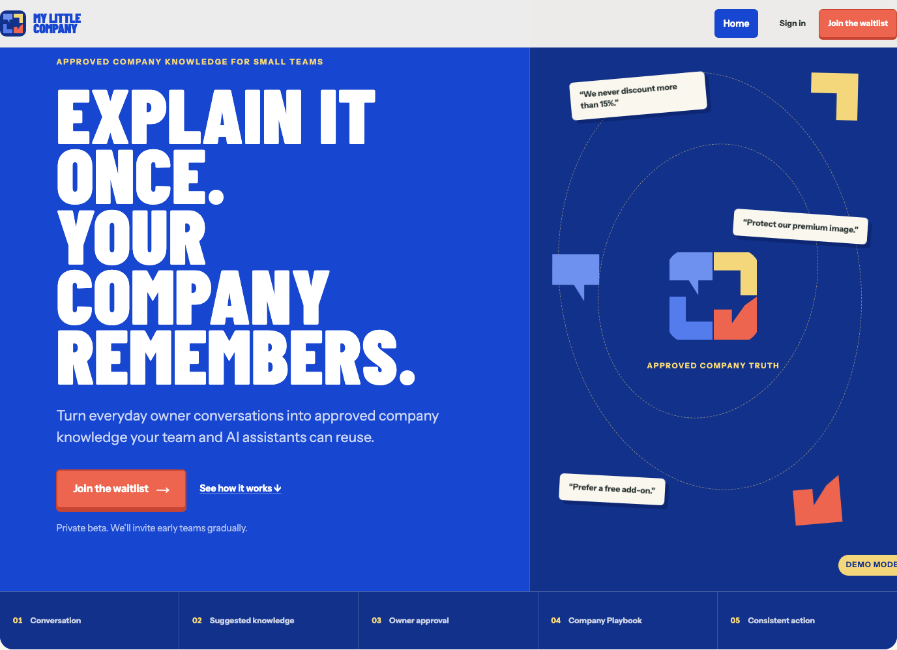
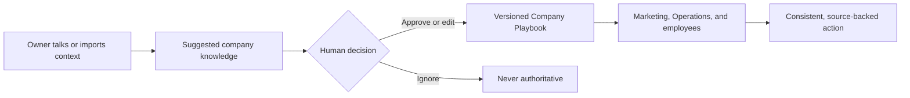
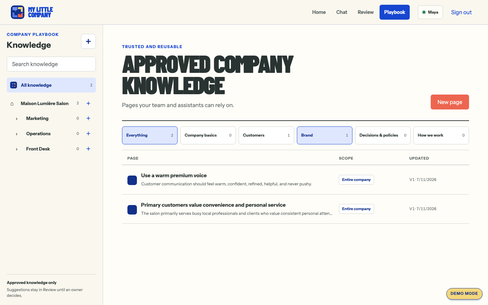
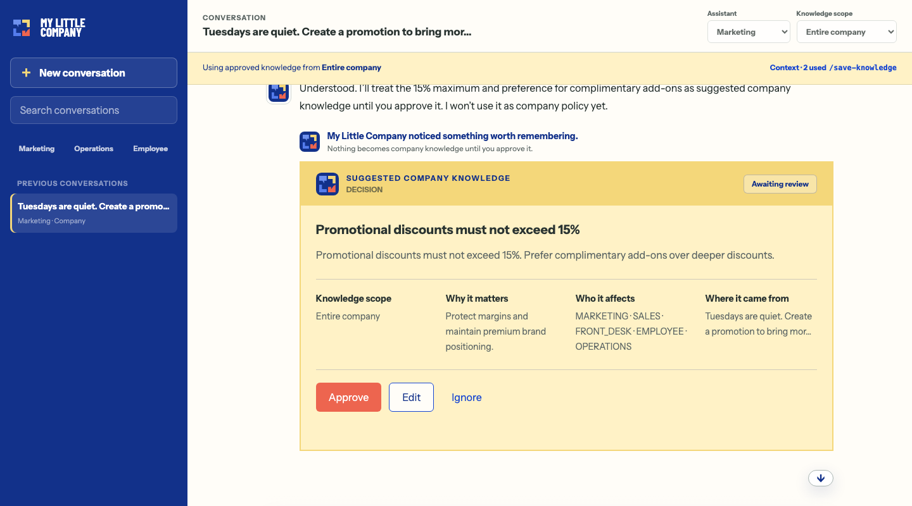

# My Little Company

> **Explain it once. Your company remembers.**

My Little Company turns the knowledge in a small-business owner's head into
approved, source-backed company knowledge. It notices durable facts, rules,
decisions, and processes during normal work, but a human decides what the
company remembers.

Once approved, that knowledge becomes a versioned Company Playbook that guides
employees and AI assistants with its source, rationale, scope, approver, and
history intact.

[**Try the live demo**](https://my-little-company-demo.netlify.app/login-demo)
· [Public site](https://my-little-company-demo.netlify.app)
· [Architecture](docs/ARCHITECTURE.md)
· [Security and trust](docs/SECURITY.md)



> The live demo uses synthetic salon data. Choose **Maya — Owner**; no password
> is required.

## The problem

Small businesses run on knowledge scattered across the owner's head, old chat
history, email, documents, and informal habits. The result is repeated
explanations, inconsistent decisions, lost rationale, slow onboarding, and AI
work that forgets how the company actually operates.

A bad AI answer is temporary. A false company memory can mislead every future
employee and assistant. My Little Company therefore treats organizational
knowledge as a governed business asset, not as another chat transcript.

## How it works



The governing rule is simple: **AI may suggest company knowledge, but it may
never approve it.** Only current, approved, company-scoped, role-allowed
knowledge can be reused as company truth.

### The Company Playbook

Approved knowledge stays visible and inspectable by company, department, topic,
scope, and version. Suggestions remain in Review until an authorized person
decides what becomes company truth.



## The five-minute hackathon proof

The demo company is a fictional salon with deterministic sample data. One owner
statement changes three later outcomes.



1. Open the [live demo](https://my-little-company-demo.netlify.app/login-demo),
   choose **Maya — Owner**, and reset the demo from the company workspace.
2. In **Marketing**, ask:

   > Tuesdays are quiet. Create a promotion to bring more customers in.

3. Teach the company one lasting rule:

   > We never discount more than 15%. We prefer offering a free add-on because
   > we want to maintain a premium image.

4. My Little Company shows a **Suggested company knowledge** card with the rule,
   rationale, source, scope, and affected roles. Nothing becomes company truth
   until the owner selects **Approve**.
5. Ask Marketing to revise the promotion. The new offer stays within 15%,
   prefers a complimentary add-on, and cites the approved rule.
6. Switch to **Operations** and generate a Tuesday Promotion SOP. The procedure
   follows the same rule; saving the SOP creates another suggestion rather than
   silently approving it.
7. Switch to **Employee** and ask:

   > Can I give a customer 25% off?

   The answer begins **No**, explains the approved 15% limit and free-add-on
   preference, and shows the source and approval date.

**One explanation → one human-approved rule → three consistent outcomes.**

## Why this is different

| Common AI knowledge failure | My Little Company's guardrail |
|---|---|
| A chat message silently becomes lasting context | AI creates a suggestion; a human approves, edits, or ignores it. |
| A model invents or changes company policy | Only current approved knowledge is authoritative. Missing context produces an honest gap, not a fabricated rule. |
| A rule loses the reason behind it | Every approved version preserves its rationale, source, approver, scope, and timestamp. |
| Old or unauthorized content appears in an answer | Retrieval rechecks company, status, current version, department, role, and sensitivity before use. |
| Search availability is mistaken for business truth | The structured Playbook remains authoritative; indexing has a separate visible and retryable state. |
| An external assistant changes company truth | Connected assistants may search, fetch, or suggest knowledge. They have no approval capability. |

This is not a generic chatbot, a document folder with search, or an AI-agent
marketplace. The product is the governed memory layer beneath employees and
assistants.

## Architecture

The application is a strict-TypeScript Next.js system with server-enforced
authorization and ports for repositories, model execution, sources, search, and
telemetry. The browser never talks directly to infrastructure providers.

```text
Next.js UI
   → validated server routes and actor checks
      → governed-memory domain services
         → repositories · model gateway · source store · knowledge index
```

Persistence, model execution, and authentication are selected independently, so
the same product rules apply in local development and in the hosted demo:

| Persistence mode | Backing services | Current status |
|---|---|---|
| `APP_MODE=local` | Local repositories and repository-backed lexical search | Complete and credential-free with `MODEL_PROVIDER=fixture`; it can also call OpenAI during development |
| `APP_MODE=aws` | DynamoDB, private S3, and repository-backed lexical search | Hosted persistence path; requires `MODEL_PROVIDER=openai` |

`AUTH_MODE=demo|cognito` selects identity separately. The durable hosted target
combines `APP_MODE=aws`, `MODEL_PROVIDER=openai`, and `AUTH_MODE=cognito`.

In the hosted design:

- **DynamoDB is the truth plane:** approved records, immutable versions, sources,
  scopes, and audit events.
- **OpenAI is the intelligence plane:** the Responses API generates structured
  suggestions, promotions, conflict assessments, SOPs, and grounded answers.
- **Repository-backed retrieval is the discovery plane:** approved DynamoDB
  records are searched and re-authorized before they can affect an answer.
- **Private S3 preserves provenance:** imported sources and deterministic
  canonical knowledge documents.
- **Cognito proves identity; application memberships grant access:** company and
  department permissions are reloaded on every request.

Owners choose a company-wide **Fast**, **Balanced**, or **Best quality** tier in
Workspace settings. The browser submits only that provider-neutral tier; model
IDs and the OpenAI API key remain server-side. There is no silent model or
fixture fallback.

The repository also includes an OAuth- and PKCE-protected MCP endpoint for
compatible assistants. It exposes search, fetch, and suggestion operations—never
approval.

### Submission status

The deterministic local journey remains the repeatable CI proof. The
OpenAI-backed web path uses the selected model tier while retaining the same
human approval, authorization, and citation checks. It must not be described as
live until the three-tier smoke and hosted browser journey pass. The private
ChatGPT/MCP connector is a later release gate and is not required for this web
demo.

## Run locally

### Prerequisites

- Node.js 22 or newer, below Node.js 25
- pnpm 10.32.1

### Start the credential-free demo

```bash
git clone https://github.com/NCK-Agency/MyLittleCompany.git
cd MyLittleCompany
pnpm install --frozen-lockfile
pnpm dev
```

Open [http://localhost:3000/login-demo](http://localhost:3000/login-demo), choose
**Maya — Owner**, and follow the demo above. Local mode is the default, so no
cloud account, API key, or `.env.local` file is required.

To override the defaults or configure hosted adapters, start from
[`.env.example`](.env.example). Never commit `.env.local` or credentials.

## Verification

The project keeps the complete local flow deterministic and exercises it through
unit, integration, and browser tests.

```bash
pnpm lint
pnpm typecheck
pnpm test
pnpm build
pnpm test:e2e
```

The browser suite proves the full journey from reset, conversation, suggestion,
approval, and Playbook reuse through compliant Marketing output, a grounded
Operations SOP, a cited Employee answer, version history, access scoping, and
responsive behavior.

Current verification results and any remaining external release gates are
recorded in `PLANS.md`. Before calling the hosted path live, run the repository
checks above plus `pnpm smoke:openai` for all three configured tiers and the
hosted Balanced browser journey.

## Technology

- Next.js 16, React 19, strict TypeScript, Tailwind CSS 4, and pnpm
- Zod validation at external and model-output boundaries
- Vitest, Testing Library, and Playwright
- Local and hosted adapters behind `MemoryRepository`, `ConversationRepository`,
  `SourceRepository`, `KnowledgeIndex`, `ModelGateway`, and `Telemetry` ports
- OpenAI Responses API for live generation and structured outputs
- DynamoDB, S3, and Cognito for the optional hosted adapter set
- Model Context Protocol SDK with OAuth authorization-code flow and PKCE

## Repository guide

```text
src/app/                  Next.js pages and validated server routes
src/domain/               Company-knowledge types and lifecycle rules
src/services/             Governed-memory application workflows
src/ports/                Provider-independent interfaces
src/adapters/local/       Complete credential-free demo adapters
src/adapters/aws/         DynamoDB and S3 persistence adapters
src/adapters/openai/      Live OpenAI Responses API model gateway
src/mcp/ and src/oauth/   Connected-assistant tools and authorization
prompts/                  Versioned AI prompt templates
schemas/                  JSON schemas for structured outputs
fixtures/                 Deterministic synthetic demo company
tests/                    Unit and integration coverage
e2e/                      Playwright product journeys
docs/                     Product, UX, architecture, trust, and deployment truth
```

Start with these documents when reviewing the project:

- [Product specification](docs/PRODUCT_SPEC.md)
- [UX specification](docs/UX_SPEC.md)
- [Architecture](docs/ARCHITECTURE.md)
- [Security and trust](docs/SECURITY.md)
- [AI behavior](docs/AI_BEHAVIOR.md)
- [Decision log](docs/DECISION_LOG.md)
- [Netlify deployment](docs/NETLIFY_DEPLOY.md)
- [MCP connection guide](docs/MCP_CONNECT.md)

The salon is only the deterministic demonstration vertical. Public product
positioning and the underlying company-memory model are business-neutral.

## License

My Little Company is available under the [MIT License](LICENSE).
