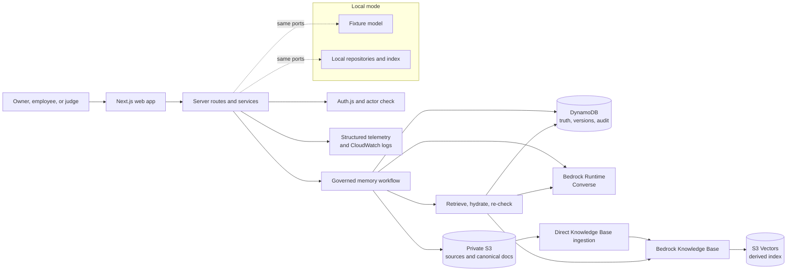
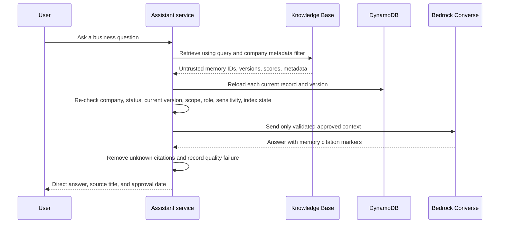

# Architecture

## 1. Decision in one sentence

My Little Company is a server-side Next.js application in which **DynamoDB owns
approved company truth**, **Amazon Bedrock creates and applies that truth**,
**S3 preserves its canonical documents**, and **Bedrock Knowledge Bases backed
by S3 Vectors provide a derived search path that is never authoritative on its
own**.

This is deliberately a three-plane design:

| Plane | Job | AWS service | Rule |
|---|---|---|---|
| Truth | Keep the current approved rule, its version, source, approver, and audit trail | DynamoDB | Only this plane decides company truth. |
| Intelligence | Generate an answer, suggestion, conflict assessment, or SOP | Amazon Bedrock Converse | Model output is untrusted until Zod validation and human approval. |
| Discovery | Find likely relevant approved rules | Bedrock Knowledge Bases + S3 Vectors | Every hit is reloaded from DynamoDB before it can influence an answer. |

The result is credible AWS logic without making the hackathon demo depend on a
queue, an agent framework, a second database, or a vector database the team must
operate.

## 2. Hackathon architecture schema



The browser calls only Next.js routes. It never receives AWS credentials and
never calls DynamoDB, S3, Bedrock, or the Knowledge Base directly.

### Main components

| Component | Responsibility | Must not do |
|---|---|---|
| Next.js UI | Make work, review, approval, index state, and citations understandable | Decide authority or construct AWS requests |
| Route handlers | Validate request shape, resolve the server actor, call one service | Trust browser company, role, or approval fields |
| Domain and services | Enforce lifecycle, scope, conflict, approval, and retrieval rules | Import AWS SDK clients |
| `ModelGateway` | Call Converse, validate/retry one malformed structured response, return safe output | Approve or persist company knowledge |
| `MemoryRepository` | Create immutable versions, conditionally transition states, append audit events | Treat an index hit as truth |
| `SourceRepository` | Save private source material and deterministic rendered memory documents | Expose direct S3 URLs |
| `KnowledgeIndex` | Ingest one search document and return untrusted candidate hits | Authorize a hit or generate a final answer |
| `Telemetry` | Record safe trace metadata, latency, prompt version, model configuration, and outcomes | Record raw secrets, tokens, or full source content |

## 3. One interface set, two complete runtime modes

The application keeps the existing ports: `MemoryRepository`,
`ConversationRepository`, `SourceRepository`, `KnowledgeIndex`,
`ModelGateway`, and `Telemetry`.

| Mode | Used for | Adapter set | Boundary |
|---|---|---|---|
| `APP_MODE=local` | Development, tests, and an emergency fallback demo | Fixture model, local repositories, lexical local index | No credentials or network calls |
| `APP_MODE=aws` | The submitted live path | Bedrock, DynamoDB, S3, and Bedrock Knowledge Base adapters | Fail fast when any AWS identifier is missing |

Do not mix individual local and AWS adapters. A partial AWS mode can make an
answer look cloud-backed while its approved memory is still ephemeral.

Local fallback is an explicit mode switch, not a silent recovery inside AWS
mode. A failed AWS model request must surface as a truthful error in the AWS
demo, because silently changing to a fixture would weaken the AWS proof.

## 4. The governing state machine

```text
Conversation or import
        |
        v
PROPOSED candidate -- Ignore --> REJECTED
        |
        | owner or scoped approver
        v
APPROVING -- conditional DynamoDB transaction --> APPROVED current version
                                                    |
                                                    | index status: PENDING
                                                    v
                                            READY or FAILED (retryable)

APPROVED current version -- explicit owner replacement --> SUPERSEDED
APPROVED current version -- explicit owner archive ------> ARCHIVED
```

`APPROVED` and `READY` are different truths:

- `APPROVED` means the Playbook is now correct in DynamoDB.
- `READY` means the derived semantic search copy has caught up.
- `FAILED` means the approved Playbook record remains correct, while assistant
  search needs a visible retry.

Only an approved, current, in-scope version may appear as company-specific
context. `PROPOSED`, `REJECTED`, `SUPERSEDED`, and `ARCHIVED` records are never
authoritative.

## 5. Write path: conversation to governed memory

```mermaid
sequenceDiagram
    participant Owner
    participant App as Next.js service
    participant Model as Bedrock Converse
    participant DB as DynamoDB

    Owner->>App: Explain a business rule in normal chat
    App->>DB: Load eligible approved context
    App->>Model: Generate useful work using approved context
    Model-->>App: Answer with permitted memory citations
    App->>Model: Extract structured candidate from the owner statement
    Model-->>App: Candidate JSON
    App->>App: Zod validation; one repair attempt at most
    App->>DB: Save PROPOSED candidate with source reference
    App-->>Owner: Answer plus Suggested company knowledge card
```

The assistant's new recommendation is not a policy. The system extracts only
from owner-supported content, preserves an absent rationale as absent, and shows
the suggestion for explicit human review.

## 6. Approval and indexing: a deliberately split path

```mermaid
sequenceDiagram
    participant Owner
    participant Review as Review service
    participant DB as DynamoDB
    participant Index as Index service
    participant S3 as Private S3
    participant KB as Bedrock Knowledge Base

    Owner->>Review: Approve, edit, replace, or add an exception
    Review->>DB: Conditional transaction: candidate, memory, version, audit
    DB-->>Review: APPROVED + PENDING
    Review-->>Owner: Approved in Playbook; search is updating
    Owner->>Index: Begin or retry adding to assistant search
    Index->>S3: Write immutable version and current search document
    Index->>KB: Ingest current document with small metadata set
    KB-->>Index: Indexed or safe failure
    Index->>DB: Set READY or FAILED; append audit
    Index-->>Owner: Available to assistants or Needs attention
```

### Why this split is important

Approval must return promptly after the DynamoDB transaction. The present code
waits for Knowledge Base indexing inside the approval request; its documented
polling loop can wait roughly 18 seconds before it reports a failure. That makes
the most important owner action feel slow and couples an approval confirmation to
an eventually consistent search service.

For the hackathon, use a second authenticated index request initiated by the UI
immediately after successful approval. It keeps the architecture simple and
reliable on a serverless host: no SQS, Step Functions, or background Lambda is
needed just to prove the demo. The UI already has the right plain-language states
and retry action.

When the active workflow knows the exact newly approved memory ID, it may pass
that one record as a clearly labelled structured bridge while indexing is pending.
Generic employee search must wait for `READY`; it must not scan arbitrary
approved records to imitate semantic retrieval.

## 7. Retrieval and grounded generation



The Knowledge Base performs discovery, not authorization. Application hydration
is mandatory because old indexed content, bad metadata, or a cross-company hit
must never become policy merely because it ranked well.

For the small salon corpus, send a company and approved-status filter to the
Knowledge Base, retrieve a bounded candidate set, and make all role, department,
sensitivity, version, and `READY` decisions after DynamoDB hydration. This avoids
relying on complex vector-store-specific filters for access control. In
particular, do not make `listContains` role filtering a security dependency when
using S3 Vectors; filter capability varies by vector store.

## 8. AWS implementation shape

### Bedrock Runtime

Use `Converse` behind `ModelGateway` for marketing responses, memory extraction,
conflict classification, SOP generation, and employee answers. Every call:

- receives a model ID or inference profile from environment configuration;
- sets an explicit `maxTokens` value, timeout, and bounded retry policy;
- loads a versioned prompt from `prompts/`;
- treats retrieved and imported text as data delimited from instructions;
- validates structured output with Zod and permits one repair attempt; and
- records safe operation metadata without raw private content.

The live model must be confirmed available in the selected region before demo
day. The current Nova Lite quota blocker is a deployment prerequisite, not a
reason to hardcode a replacement into domain logic.

### DynamoDB

One table is sufficient for the demo. It holds company profile, memberships,
conversations, candidates, memory records, immutable versions, sources, and
audit events. Approval is an idempotent conditional transaction that prevents a
double click or concurrent reviewer from creating two current versions.

### S3

Keep all objects private and company-prefixed. Store:

```text
sources/{companyId}/{sourceId}.json
memories/{companyId}/{memoryId}/v{version}.md       # immutable audit copy
search/{companyId}/{memoryId}/current.md            # sole KB search document
```

The immutable version document preserves history. The stable `current.md` URI is
the only document ingested for semantic search; its metadata contains the
current version. This prevents every amendment from leaving an additional stale
vector that must later be filtered out.

### Knowledge Base and S3 Vectors

Use the configured S3 data source and direct document ingestion after the current
search document is written. S3 Vectors is the lowest-operations choice for this
hackathon. Keep metadata compact and filterable:

```text
companyId, memoryId, version, status, scopeLevel,
organizationalUnitId, memoryType, sensitivity
```

Amazon Bedrock currently limits S3 Vectors Knowledge Base custom metadata to 1
KB and 35 metadata keys. This design uses well below both limits. The KB service
role needs only the S3 read permissions, embedding-model invocation, and S3
Vectors operations required by the configured Knowledge Base. The web runtime
role separately needs the direct-ingestion and retrieval actions it actually
uses.

### Identity and observability

Cognito/Auth.js identity and application-owned memberships stay outside the
main demo diagram because they support, rather than define, the memory proof.
Every route still resolves an active membership server-side. Emit structured
events with a trace ID, operation, company pseudonym, model configuration,
latency, status, and memory IDs. CloudWatch is enough for the competition; do
not add a second observability product before the AWS smoke test passes.

## 9. Architecture critique and improvements

| Finding | Evidence in the current implementation | Improvement in this target architecture |
|---|---|---|
| The main architecture tells too many stories at once. | The previous primary diagram gave equal visual weight to Apify, Langfuse, auth, and future services. | Center the one judge-visible loop: chat, approval, DynamoDB, S3, Knowledge Base, retrieval, Bedrock. Keep imports, MCP, and rich onboarding at extension boundaries. |
| Approval is coupled to slow indexing. | `MemoryService.indexMemory` runs during approval; `BedrockKnowledgeIndex.waitUntilIndexed` polls up to 24 times. | Return `APPROVED/PENDING` from the transaction, then index through a separate route with a visible retry state. |
| Each memory version can create a stale search vector. | The current S3 key and Knowledge Base document identity include `v{version}`. | Preserve immutable version files, but ingest only one stable current search document per memory. |
| Retrieval is secure only if hydration remains non-negotiable. | The code correctly reloads DynamoDB records after Knowledge Base retrieval. | Keep hydration central, test it with stale version, wrong company, wrong department, and wrong role fixtures. |
| S3 Vectors should reduce operations, not weaken authorization. | Existing retrieval adds a role-list metadata filter. | Treat KB filtering as a relevance optimization. Enforce access after hydration, and validate optional filters against the chosen vector-store capability. |
| AWS proof is still externally blocked. | The real smoke test lacks provisioned resources and the configured model quota is zero. | Treat model capacity, a private S3 bucket, DynamoDB table, Knowledge Base/data source, IAM roles, and `pnpm smoke:aws` as one pre-demo release gate. |
| The current composition root is a single large dependency factory. | `src/server/container.ts` constructs every adapter, including optional integrations. | Keep it for the hackathon, but split it into local and AWS factory functions before adding another integration. Do not introduce a DI framework. |

## 10. Explicit non-goals for the live architecture

- No Bedrock Agents, AgentCore, multi-agent orchestration, or action groups.
- No event bus, queue, workflow engine, or infrastructure-as-code requirement
  before the demo works.
- No second operational datastore, cache, or vector database.
- No autonomous approval, external publishing, or client-side AWS access.
- No production-scale reconciliation worker. The explicit index retry is enough
  for the hackathon; reconciliation becomes a follow-up once real usage exists.

## 11. Judge-facing proof and release gate

Before presenting AWS mode, demonstrate these facts in the live app and console:

1. A Bedrock Converse request creates the marketing response and structured
   suggestion, but the suggestion is still `PROPOSED`.
2. Owner approval produces a DynamoDB current version and an audit event.
3. S3 contains the canonical current search document.
4. Direct Knowledge Base ingestion reaches `READY`, backed by S3 Vectors.
5. A later Marketing, Operations, or Employee request retrieves the rule,
   hydrates it from DynamoDB, and cites it.
6. Proposed, superseded, wrong-company, and wrong-role records are rejected even
   if a retrieval fixture returns them.
7. An indexing failure says “Approved in the Playbook, but not yet available to
   assistants,” and offers retry rather than faking success.

`pnpm smoke:aws` and `pnpm test:e2e:aws` are the final evidence. Until they pass
against provisioned resources, the local demo remains valuable but the AWS path
must be described as implemented and unverified, not complete.

## 12. Implementation status

The port boundaries, Bedrock model gateway, DynamoDB/S3 adapters, direct
Knowledge Base ingestion, retrieval hydration, local adapter set, and smoke-test
scripts already exist. The refreshed architecture deliberately identifies two
follow-up changes before AWS-mode demo hardening:

1. decouple approval confirmation from Knowledge Base polling; and
2. change semantic ingestion from one document per immutable version to one
   stable current document per memory.

Those are targeted reliability improvements, not a request to expand product
scope. The existing real-AWS resource and quota blockers remain the prerequisite
for proving the path end to end.
