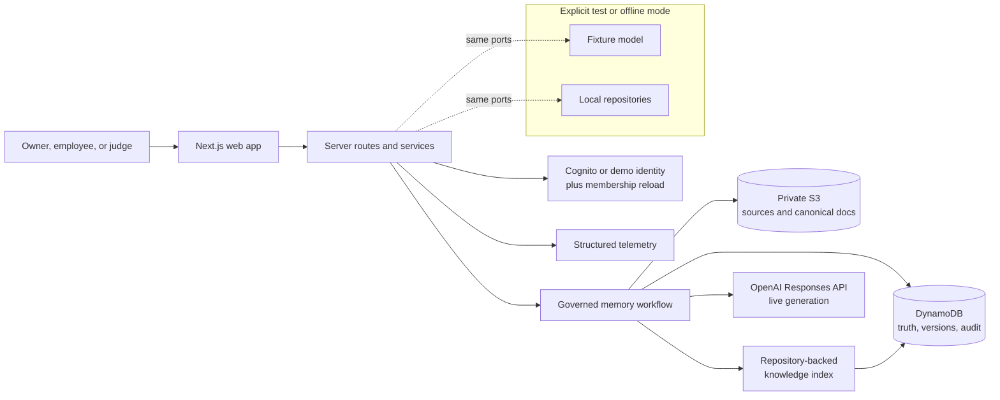
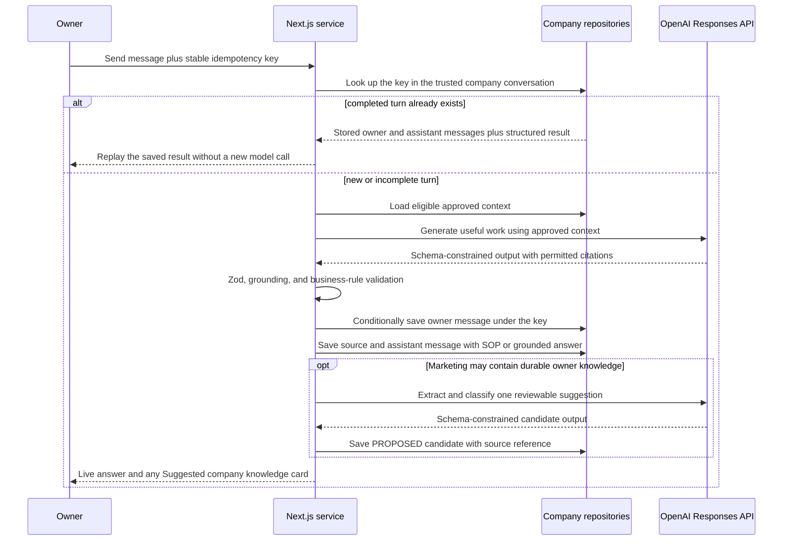
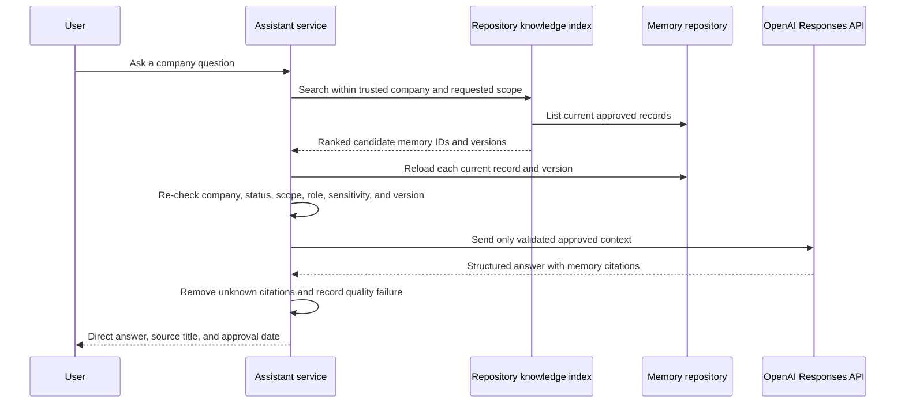

# Architecture

## 1. Decision in one sentence

My Little Company is a server-side Next.js application in which **DynamoDB owns
approved company truth**, **OpenAI creates live assistant output**, **private S3
preserves source material and canonical documents**, and a **repository-backed
index finds current approved knowledge without becoming authoritative**.

The active hosted design has four responsibilities:

| Responsibility | Implementation | Rule |
|---|---|---|
| Truth | DynamoDB repositories | Only approved current records define company truth. |
| Intelligence | OpenAI Responses API | Model output remains untrusted until validation and, for knowledge, human approval. |
| Discovery | `RepositoryKnowledgeIndex` over the active memory repository | Search returns candidates; server-side eligibility still decides what may be used. |
| Provenance and identity | Private S3 and Cognito/Auth.js | Sources stay private; identity never replaces application membership authorization. |

OpenAI File Search and embeddings are intentionally excluded from the migration.
The salon corpus is small enough for repository-backed lexical retrieval, which
keeps the complete approval-and-reuse proof fast and operationally simple.

## 2. Active architecture



The browser calls only authenticated Next.js routes. It never receives the
OpenAI API key, AWS credentials, arbitrary model identifiers, or trusted company
and role fields.

### Main components

| Component | Responsibility | Must not do |
|---|---|---|
| Next.js UI | Explain work, review, approval, model selection, and citations | Decide authority or call OpenAI/AWS directly |
| Route handlers | Validate input, resolve the actor, call one service | Trust browser company, role, approval, or model-ID fields |
| Domain and services | Enforce lifecycle, scope, conflict, approval, and retrieval rules | Import provider SDK clients |
| `ModelGateway` | Receive `companyId`, invoke one configured model, validate output, and return safe results | Approve or persist company knowledge |
| `MemoryRepository` | Create immutable versions, transition state, list eligible records, and append audit events | Treat model output or a search score as truth |
| `SourceRepository` | Save private source material and canonical rendered memory documents | Expose direct S3 URLs |
| `KnowledgeIndex` | Rank current approved repository records | Authorize a result or generate a final answer |
| `Telemetry` | Record safe trace metadata, latency, prompt version, tier, actual model ID, and outcome | Record keys, raw private content, or hidden reasoning |

## 3. Persistence and model selection are independent

The existing ports remain: `MemoryRepository`, `ConversationRepository`,
`SourceRepository`, `KnowledgeIndex`, `ModelGateway`, and `Telemetry`.

`APP_MODE` selects persistence. `MODEL_PROVIDER` selects intelligence. They do
not implicitly change one another.

| Configuration | Purpose | Active adapter |
|---|---|---|
| `APP_MODE=local` | Local development and deterministic CI | Local repositories and repository index |
| `APP_MODE=aws` | Durable hosted company state | DynamoDB repositories, private S3, and repository index |
| `MODEL_PROVIDER=fixture` | Automated tests or explicitly labelled offline operation | Deterministic fixture gateway |
| `MODEL_PROVIDER=openai` | Hosted and live-demo generation | OpenAI Responses gateway |

A hosted demo must use `MODEL_PROVIDER=openai`. A model error remains a visible,
retryable error; the application never silently changes provider, model tier, or
fixture mode.

## 4. Owner model selection

Each company stores only one provider-neutral tier:

```ts
type AssistantModelTier = "FAST" | "BALANCED" | "BEST";
```

`BALANCED` is the default for existing, reset, and newly created companies. The
server maps the tier to one allowed environment value:

```text
FAST     -> OPENAI_MODEL_FAST
BALANCED -> OPENAI_MODEL_BALANCED
BEST     -> OPENAI_MODEL_BEST
```

Only an owner may read or update Assistant settings. The API accepts the enum,
not a vendor model ID. Every `ModelGateway` operation receives the trusted
`companyId`; the OpenAI adapter loads the current company setting immediately
before the request, resolves the allowed model server-side, and records both the
tier and actual model ID in safe operation metadata. The next request uses a new
selection; prior messages are never regenerated.

If the selected model is unavailable, return the typed provider error rendered
as “This assistant model is temporarily unavailable,” with Retry and an
owner-only link to Assistant settings. Do not auto-select another tier.

## 5. Governing state machine

```text
Conversation or import
        |
        v
PROPOSED candidate -- Ignore --> REJECTED
        |
        | owner or scoped approver
        v
APPROVING -- conditional repository write --> APPROVED current version

APPROVED current version -- explicit owner replacement --> SUPERSEDED
APPROVED current version -- explicit owner archive ------> ARCHIVED
```

Only an approved, current, in-scope version may appear as company-specific
context. `PROPOSED`, `REJECTED`, `SUPERSEDED`, and `ARCHIVED` records are never
authoritative. Repository-backed indexing has no remote ingestion job: a newly
approved current record becomes discoverable when the authoritative repository
write succeeds. Existing index-status fields remain compatibility and audit
metadata, not a second truth plane.

## 6. Write path: conversation to governed memory



OpenAI Structured Outputs constrain the response shape; Zod and domain checks
still enforce product rules. The assistant's recommendation is not policy. The
system preserves missing rationale as missing and requires explicit human review.
A provider failure during initial generation leaves no orphan owner turn. If a
later suggestion step fails after the answer was saved, the same request key can
resume that suggestion without duplicating the conversation.

## 7. Approval, retrieval, and grounded generation

Approval writes the source-backed immutable version and audit event to the
authoritative repository. In AWS mode, S3 retains the private source and
canonical rendered document, but no external vector ingestion gates retrieval.



The index performs discovery, not authorization. Company, role, department,
sensitivity, status, and current-version checks remain central even when the
repository query was already scoped. If nothing relevant survives, the service
returns the standard no-approved-context answer rather than inviting the model
to invent a company rule.

## 8. OpenAI integration

`OpenAIModelGateway` uses the Responses API for marketing work, candidate
extraction, conflict classification, SOP generation, and employee answers.
Every call:

- receives the trusted `companyId` and resolves the company's current tier;
- loads a versioned prompt from `prompts/`;
- requests strict schema-constrained output for structured operations;
- treats retrieved and imported content as delimited untrusted data;
- validates output with Zod and existing citation/business rules;
- permits at most one bounded retry for timeouts, rate limits, and transient
  provider failures, plus the existing single safe repair path where applicable;
- uses an explicit timeout and output limit; and
- records prompt version, tier, actual model ID, latency, tokens, and safe status.

The API key and tier-to-model mapping are Functions-runtime secrets/configuration.
Neither is stored on the company profile or sent to the browser.

### Provider retry and user retry are different boundaries

The OpenAI gateway owns one short transport retry for a timeout, rate limit, or
transient provider failure. It uses the same company tier and model; it never
changes configuration. If that still fails, the API returns a typed error and
the browser restores the user's draft.

The conversation service owns the later user-visible Retry action:

1. The browser reuses the original idempotency key and message text.
2. Reusing a key with different text returns `CONFLICT` rather than attaching a
   new answer to an old source.
3. An initial model failure has not persisted an owner message, so Retry starts
   the same logical turn cleanly.
4. If the completed assistant message already exists, the repository returns
   its stored SOP or grounded-answer payload and does not invoke OpenAI again.
5. DynamoDB message replay uses a strongly consistent base-table query so an
   immediate Retry cannot miss the completed result and append a duplicate.

This boundary makes retry truthful: the user either receives the original saved
result or one new attempt for the same request, never a hidden fixture response.

## 9. Durable hosting

### DynamoDB

One table holds company profiles and assistant tier, memberships,
conversations, messages, candidates, memory records, immutable versions,
sources, audit events, onboarding state, and waitlist entries. Assistant
messages retain the structured SOP or grounded-answer data needed to reopen or
replay the exact UI result. Message idempotency markers and strongly consistent
replay reads prevent duplicate assistant turns. Approval remains an idempotent
conditional transaction so concurrent clicks cannot create two current versions.

### S3

Objects remain encrypted, private, and company-prefixed:

```text
sources/{companyId}/{sourceId}.json
imports/{companyId}/{sourceId}
memories/{companyId}/{memoryId}/v{version}.md
```

S3 is provenance and durable document storage, not the retrieval index. The
browser receives application routes and safe source labels, never direct bucket
URLs.

### Identity and observability

Cognito/Auth.js establishes identity; the application reloads active membership
and grants for every request. Emit structured events with a trace ID,
pseudonymous company identifier, operation, prompt version, tier, actual model
ID, latency, token counts, and safe error code. Do not log raw content or keys.

## 10. Explicit non-goals

- No OpenAI File Search, embedding pipeline, or external vector database.
- No silent provider, model-tier, or fixture fallback.
- No browser-supplied model IDs or client-side OpenAI calls.
- No autonomous approval, external publishing, or model-written company truth.
- No new primary-navigation item for model configuration.
- No private ChatGPT/MCP acceptance requirement for this web migration; that
  integration remains a later checkpoint.

## 11. Release proof

Before presenting the hosted web demo:

1. `smoke:openai` completes a minimal schema-constrained request with every
   configured tier; a failing model is not exposed in the UI.
2. The owner changes the tier in Workspace and the next operation records and
   uses its configured model ID.
3. The live model creates the marketing response and suggestion, while the
   suggestion remains `PROPOSED` until a human approves it.
4. Approval persists the current version, rationale, source, and approver in
   DynamoDB and its canonical document in private S3.
5. A later Marketing, Operations, and Employee request finds the approved rule
   through repository retrieval and cites it.
6. Proposed, superseded, wrong-company, and wrong-role records remain excluded.
7. A provider failure restores the same draft and request key, shows Retry, and
   never returns fixture content; a completed retry replay retains its SOP or
   grounded-answer card without another model call.

The release gate is `pnpm lint`, `pnpm typecheck`, `pnpm test`, `pnpm build`,
`pnpm test:e2e`, the three-tier OpenAI smoke, and one complete hosted Balanced
salon journey. Private ChatGPT acceptance follows separately.
