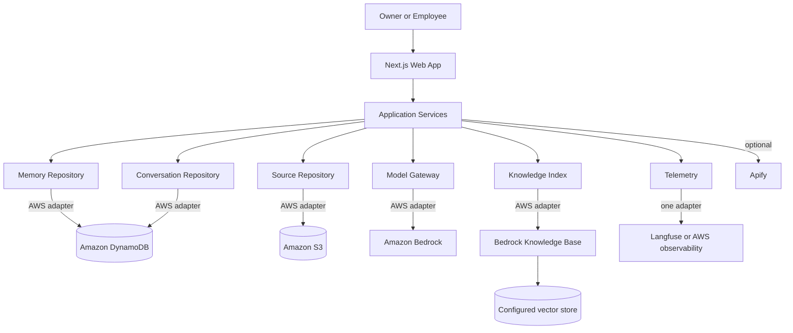
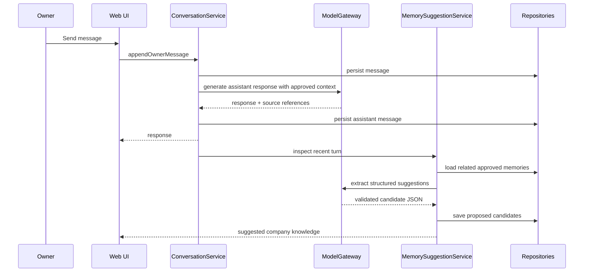
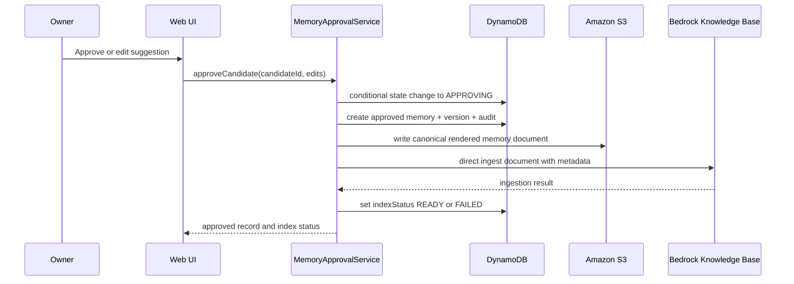
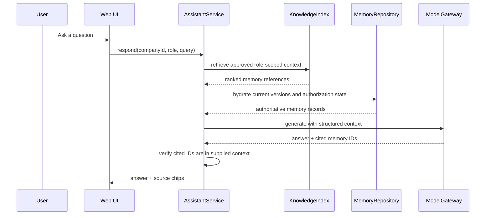

# Architecture

## 1. Architectural goal

Support a reliable hackathon demo without trapping the product in demo-only code.

The architecture separates:

- Domain rules.
- Application workflows.
- User interface.
- AI model access.
- Structured persistence.
- Search/index retrieval.
- Source storage.
- Telemetry.

The same UI and services should work with local adapters and AWS adapters.

## 2. High-level architecture



## 3. Runtime modes

### Local mode

Purpose: fast development, deterministic tests, and a fallback demo.

- In-memory or file-backed repositories.
- Deterministic model fixtures keyed by demo inputs.
- Simple lexical retrieval over approved local records.
- No external credentials required.

Set:

```text
APP_MODE=local
```

### AWS mode

Purpose: deployed track-qualifying experience.

- Bedrock for inference.
- DynamoDB for structured state.
- S3 for source and rendered-memory artifacts.
- Bedrock Knowledge Base for retrieval.
- Optional Guardrails and telemetry.

Set:

```text
APP_MODE=aws
```

Adapters are selected during server initialization. Do not scatter `if (APP_MODE)` checks throughout UI code.

## 4. Logical layers

### 4.1 Domain

Suggested path: `src/domain/`

Contains:

- Entity and value-object types.
- Zod schemas.
- Memory lifecycle state transitions.
- Retrieval-eligibility rules.
- Conflict relation types.
- Role and company authorization rules.
- Pure rendering functions for index documents.

Domain code must not import Next.js, AWS SDK, or vendor clients.

### 4.2 Application services

Suggested path: `src/services/`

Core services:

- `ConversationService`
- `MemorySuggestionService`
- `MemoryApprovalService`
- `MemoryRetrievalService`
- `AssistantService`
- `SopService`
- `DemoResetService`

Services coordinate repositories and gateways. They own transactions and compensation behavior at the application level.

### 4.3 Ports

Suggested path: `src/ports/`

```ts
interface MemoryRepository {}
interface ConversationRepository {}
interface SourceRepository {}
interface KnowledgeIndex {}
interface ModelGateway {}
interface Telemetry {}
interface Clock {}
interface IdGenerator {}
```

Use explicit method contracts rather than a generic CRUD repository.

### 4.4 Adapters

Suggested paths:

```text
src/adapters/local/
src/adapters/aws/
src/adapters/apify/
src/adapters/langfuse/
```

External SDK-specific objects must not leak into domain or UI code.

### 4.5 Web layer

Suggested path: `src/app/` and `src/components/`

- Server components for data loading where useful.
- Client components only for interactive state.
- Route handlers or server actions call application services.
- All authorization and validation is repeated server-side.

## 5. Core write flow: conversation to suggestion



The assistant response and suggestion extraction may run sequentially for simplicity. They may be parallelized later only if observability and failure behavior remain clear.

## 6. Approval and indexing flow



### Consistency rule

DynamoDB is the structured source of truth. The knowledge index is a derived search representation.

Approval and indexing are not a single atomic transaction. Therefore:

- Persist approved memory first with `indexStatus=PENDING`.
- Render and store the canonical document.
- Attempt direct ingestion.
- Mark `READY` only after confirmation.
- Mark `FAILED` with a safe error code on failure.
- Provide idempotent retry using the same memory/version document identifier.

Assistants should normally retrieve only records with `status=APPROVED` and `indexStatus=READY`. A controlled fallback may retrieve newly approved records directly from DynamoDB for the current company while indexing catches up, but the response must still enforce all eligibility rules.

## 7. Retrieval and generation flow



Hydrating index results from DynamoDB prevents a stale or malformed index record from becoming authoritative.

## 8. Bedrock Knowledge Base strategy

Use a Knowledge Base configured with a data source that supports direct ingestion.

For each approved memory version, render one canonical Markdown document containing:

- Stable memory ID.
- Version.
- Type.
- Title.
- Statement.
- Rationale.
- Applicable roles.
- Effective date.
- Approval metadata.
- Source references.
- Tags.

Attach filterable metadata where supported:

- `companyId`
- `memoryId`
- `version`
- `memoryType`
- `status`
- `indexStatus`
- `roles`
- `sensitivity`
- `effectiveFrom`

Always enforce company and role scope in application logic even when the knowledge index also filters.

### Why direct ingestion

Approval should make a memory available without waiting for a full data-source synchronization. Keep an S3 canonical copy so search can be rebuilt and audited.

## 9. DynamoDB strategy

Use one table for the MVP with composite keys and one general-purpose secondary index. See `docs/DATA_MODEL.md`.

Reasons:

- Fewer resources to operate.
- Natural company-level grouping.
- Conditional updates for state transitions.
- Event and version history can share the table.

Avoid forcing every future query into the single-table design. Repository interfaces allow later migration.

## 10. S3 layout

```text
sources/{companyId}/{sourceId}/original.{ext}
sources/{companyId}/{sourceId}/normalized.md
memories/{companyId}/{memoryId}/v{version}.md
artifacts/{companyId}/{artifactId}/v{version}.json
exports/{companyId}/...
```

Use server-side encryption and block public access. Store only necessary demo data.

## 11. Model invocation

Use a `ModelGateway` abstraction with operations such as:

```ts
generateAssistantResponse(input)
extractMemoryCandidates(input)
classifyMemoryRelationship(input)
generateSop(input)
```

The AWS adapter uses the Bedrock runtime. Keep the model ID configurable. Validate output with Zod and record prompt version, model configuration, latency, and safe token metrics.

## 12. Guardrails and content trust

Guardrails may be applied to user input and model output, but the application must not assume retrieved source chunks are safe or instruction-free.

Controls must include:

- Delimited context blocks.
- Explicit instruction that retrieved text is data.
- Source normalization and size limits.
- Approval before company truth.
- Server-side hydration and eligibility checks.
- Output citation validation.

See `docs/SECURITY.md`.

## 13. Authentication and authorization

### Hackathon mode

A single seeded demo owner and demo employee are acceptable if clearly marked. Even in demo mode, every server call receives an actor and company scope from trusted server session state, not arbitrary browser fields.

### Production direction

Use a managed identity provider such as Amazon Cognito and role memberships stored per company. This is not P0.

## 14. Observability

Instrument these spans:

- Conversation request.
- Memory retrieval.
- Assistant generation.
- Suggestion extraction.
- Conflict comparison.
- Approval transaction.
- S3 render/write.
- Knowledge Base ingestion.
- Employee Q&A.

Record:

- Trace ID.
- Company pseudonymous ID.
- Actor role.
- Operation.
- Prompt version.
- Model ID or inference profile.
- Latency.
- Token metrics where available.
- Retrieved memory IDs and versions.
- Outcome and safe error code.

Do not send secrets, raw credentials, or unnecessary sensitive company content to telemetry.

## 15. Deployment shape

### Web

- Next.js app deployed to Netlify or an AWS-compatible deployment target.
- Server-side functions hold AWS access.
- Environment values configured in the deployment platform.

### AWS resources

- Bedrock model access.
- Bedrock Knowledge Base and data source.
- DynamoDB table.
- S3 bucket.
- Least-privilege IAM role for the web runtime.
- Optional Guardrail.
- Optional CloudWatch or AgentCore observability.

Infrastructure may initially be documented console setup for speed. Codex may add AWS CDK after the working integration exists, but infrastructure automation must not block the demo.

## 16. Suggested repository structure

```text
src/
  app/
    (app)/
      page.tsx
      chat/
      review/
      playbook/
    api/
  components/
    chat/
    memory/
    playbook/
    ui/
  domain/
    company.ts
    conversation.ts
    memory.ts
    sop.ts
    audit.ts
  services/
    assistant-service.ts
    memory-approval-service.ts
    memory-retrieval-service.ts
    memory-suggestion-service.ts
    sop-service.ts
  ports/
    memory-repository.ts
    conversation-repository.ts
    source-repository.ts
    knowledge-index.ts
    model-gateway.ts
    telemetry.ts
  adapters/
    local/
    aws/
  lib/
    env.ts
    errors.ts
    ids.ts
    auth.ts
prompts/
schemas/
fixtures/
tests/
e2e/
```
