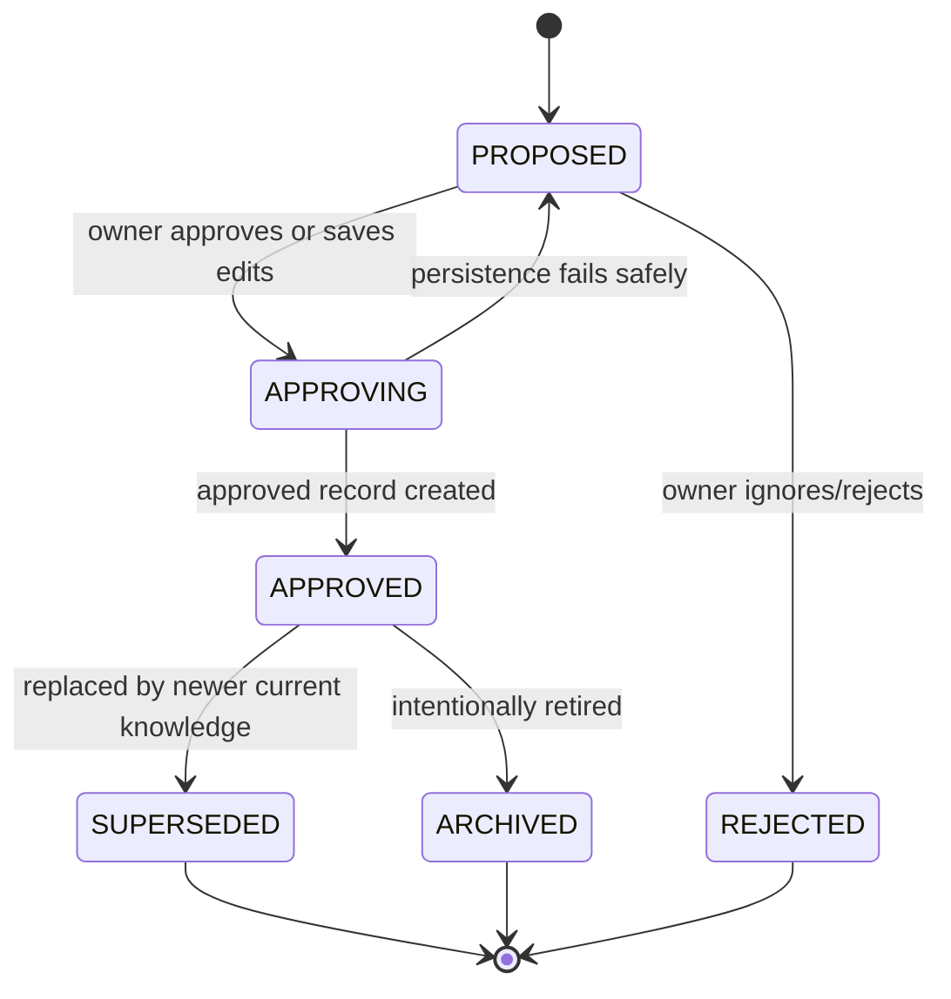
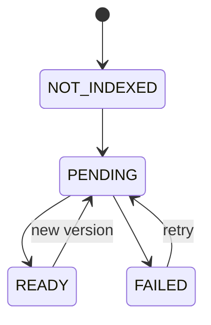

# Data Model

## 1. Modeling principles

- Company scope is mandatory on every business entity.
- Proposed and approved knowledge are separate concepts.
- Version history is immutable.
- The current memory record points to the active version.
- Search documents are derived from structured source-of-truth records.
- Sources and audit events retain provenance.
- Domain status and index status are separate.

## 2. Identifier types

Use opaque string IDs. Branded TypeScript types are encouraged.

```ts
type CompanyId = string & { readonly __brand: "CompanyId" };
type OrganizationalUnitId = string & { readonly __brand: "OrganizationalUnitId" };
type UserId = string & { readonly __brand: "UserId" };
type ConversationId = string & { readonly __brand: "ConversationId" };
type MessageId = string & { readonly __brand: "MessageId" };
type CandidateId = string & { readonly __brand: "CandidateId" };
type MemoryId = string & { readonly __brand: "MemoryId" };
type SourceId = string & { readonly __brand: "SourceId" };
type ArtifactId = string & { readonly __brand: "ArtifactId" };
```

## 3. Enumerations

### Memory type

```ts
type MemoryType =
  | "COMPANY_FACT"
  | "CUSTOMER_INSIGHT"
  | "BRAND_RULE"
  | "POLICY"
  | "DECISION"
  | "SOP"
  | "LESSON";
```

### Candidate status

```ts
type CandidateStatus =
  | "PROPOSED"
  | "APPROVING"
  | "APPROVED"
  | "REJECTED";
```

`APPROVING` supports an idempotent state transition. A failed approval operation must either return to `PROPOSED` or point to the created approved record; it must never remain ambiguous indefinitely.

### Memory status

```ts
type MemoryStatus =
  | "APPROVED"
  | "SUPERSEDED"
  | "ARCHIVED";
```

### Index status

```ts
type IndexStatus =
  | "NOT_INDEXED"
  | "PENDING"
  | "READY"
  | "FAILED";
```

### Conflict relation

```ts
type ConflictRelation =
  | "UNRELATED"
  | "DUPLICATE"
  | "UPDATE"
  | "CONTRADICTION"
  | "EXCEPTION";
```

### Assistant model tier

```ts
type AssistantModelTier = "FAST" | "BALANCED" | "BEST";
```

The company stores only this provider-neutral tier. `BALANCED` is the default.
Vendor model IDs remain server configuration and are never accepted from the
browser or persisted as a company preference.

### Role

```ts
type CompanyRole =
  | "OWNER"
  | "MANAGER"
  | "MARKETING"
  | "OPERATIONS"
  | "SALES"
  | "FRONT_DESK"
  | "EMPLOYEE";
```

### Sensitivity

```ts
type Sensitivity = "PUBLIC" | "INTERNAL" | "CONFIDENTIAL";
```

The MVP should not store secrets as memory at any sensitivity level.

### Organizational scope

```ts
type OrganizationalUnitType = "COMPANY" | "DEPARTMENT";

interface KnowledgeScope {
  level: OrganizationalUnitType;
  organizationalUnitId?: OrganizationalUnitId;
}
```

`organizationalUnitId` is required for department scope and omitted for company
scope. The referenced unit must belong to the same company as the entity.

## 4. Core entities

### 4.1 Company

```ts
interface Company {
  id: CompanyId;
  name: string;
  description: string;
  productsOrServices: string[];
  primaryCustomers: string[];
  differentiators: string[];
  brandVoice: string[];
  organizationalUnits: OrganizationalUnit[];
  assistantModelTier: AssistantModelTier;
  timezone: string;
  createdAt: string;
  updatedAt: string;
}

interface OrganizationalUnit {
  id: OrganizationalUnitId;
  companyId: CompanyId;
  parentId: OrganizationalUnitId | null;
  type: "COMPANY" | "DEPARTMENT";
  name: string;
  createdAt: string;
  updatedAt: string;
}
```

### 4.2 User membership

```ts
interface CompanyMembership {
  companyId: CompanyId;
  userId: UserId;
  email: string;
  displayName: string;
  identityProvider: "DEMO" | "COGNITO";
  identitySubject: string;
  roles: CompanyRole[];
  grants: Array<{
    permission: "READ" | "SUGGEST" | "APPROVE";
    scope: KnowledgeScope;
  }>;
  status: "INVITED" | "ACTIVE" | "DISABLED";
  createdAt: string;
  updatedAt: string;
}
```

`roles` describe who knowledge applies to; grants authorize human actions. Owner
membership is the only implicit full-access role. The demo seeds fixed memberships.

### 4.3 Conversation

```ts
interface Conversation {
  id: ConversationId;
  companyId: CompanyId;
  title: string;
  assistantRole: "MARKETING" | "OPERATIONS" | "EMPLOYEE";
  scope: KnowledgeScope;
  createdBy: UserId;
  createdAt: string;
  updatedAt: string;
}
```

### 4.4 Message

```ts
interface Message {
  id: MessageId;
  companyId: CompanyId;
  conversationId: ConversationId;
  actorType: "USER" | "ASSISTANT" | "SYSTEM_EVENT";
  actorId?: UserId;
  content: string;
  sourceRefs: SourceReference[];
  sop?: SopDraft;
  groundedAnswer?: GroundedAnswer;
  createdAt: string;
}
```

`sop` and `groundedAnswer` exist only on assistant messages. They preserve the
validated structured result required to reopen a conversation or replay a
completed retry without calling the model again. A stored SOP may include safe
operation metadata such as prompt version and actual model ID; neither payload
contains hidden reasoning or provider-private response content.

`SopDraft` is the validated procedure shape defined by `sopDraftSchema` and
`schemas/sop.schema.json`: purpose, trigger, prerequisites, ordered steps,
checks, exceptions, escalation, inputs, outputs, assumptions, and approved
memory references. `GroundedAnswer` stores the rendered answer, grounding
status, and the validated memory ID, version, title, and approval date for each
source.

The client-generated message idempotency key is stored as a repository marker
pointing to the owner message rather than as an editable message field. The same
key must carry the same normalized request content. A different body returns
`CONFLICT`. DynamoDB reads the completed message sequence consistently before a
retry decides whether generation is still required.

Do not persist hidden chain-of-thought or provider-private reasoning.

### 4.5 Source

```ts
interface Source {
  id: SourceId;
  companyId: CompanyId;
  kind: "CONVERSATION" | "WEBSITE" | "DOCUMENT" | "MANUAL";
  title: string;
  uri?: string;
  storageKey?: string;
  trustLevel: "OWNER_STATEMENT" | "INTERNAL_DOCUMENT" | "EXTERNAL_IMPORT";
  createdBy: UserId;
  createdAt: string;
}

interface SourceReference {
  sourceId: SourceId;
  label: string;
  messageId?: MessageId;
  excerpt?: string;
}
```

Excerpts must be short and safe to display.

### 4.6 Memory candidate

```ts
interface MemoryCandidate {
  id: CandidateId;
  companyId: CompanyId;
  conversationId?: ConversationId;
  scope: KnowledgeScope;
  type: MemoryType;
  title: string;
  statement: string;
  rationale: string | null;
  rationaleMissing: boolean;
  appliesToRoles: CompanyRole[];
  tags: string[];
  sensitivity: Sensitivity;
  sourceRefs: SourceReference[];
  confidence: number;
  relation: ConflictRelation;
  relatedMemoryIds: MemoryId[];
  status: CandidateStatus;
  extractionPromptVersion: string;
  modelId: string;
  createdBy: UserId;
  createdAt: string;
  reviewedBy?: UserId;
  reviewedAt?: string;
  approvedMemoryId?: MemoryId;
}
```

`confidence` is a model-assistance signal, not a truth score. It must not trigger automatic approval.

### 4.7 Memory record

```ts
interface MemoryRecord {
  id: MemoryId;
  companyId: CompanyId;
  type: MemoryType;
  status: MemoryStatus;
  currentVersion: number;
  title: string;
  scope: KnowledgeScope;
  appliesToRoles: CompanyRole[];
  sensitivity: Sensitivity;
  tags: string[];
  effectiveFrom: string;
  supersedesMemoryId?: MemoryId;
  supersededByMemoryId?: MemoryId;
  createdAt: string;
  updatedAt: string;
  indexStatus: IndexStatus;
  indexDocumentId?: string;
  lastIndexAttemptAt?: string;
  indexErrorCode?: string;
}
```

The record contains list-view and retrieval-routing fields. Canonical content lives in versions.

### 4.8 Memory version

```ts
interface MemoryVersion {
  memoryId: MemoryId;
  companyId: CompanyId;
  version: number;
  title: string;
  scope: KnowledgeScope;
  statement: string;
  rationale: string | null;
  appliesToRoles: CompanyRole[];
  sensitivity: Sensitivity;
  tags: string[];
  effectiveFrom: string;
  sourceRefs: SourceReference[];
  approvedBy: UserId;
  approvedAt: string;
  originatingCandidateId?: CandidateId;
  createdAt: string;
}
```

Versions are append-only. Corrections create a new version.

A direct Playbook amendment by an authorized owner creates the next immutable
version and atomically advances `MemoryRecord.currentVersion`. The new version
retains prior source references and adds a `MANUAL` source reference representing
the owner-authored edit. Its structured state is authoritative immediately;
the repository-backed index marks the current record `READY` when that
authoritative write is visible. No remote vector-ingestion job is involved.

Directly created Playbook pages follow the same approved record and immutable
version model. A page created from chat references the selected conversation
messages; a page created in the Playbook receives a `MANUAL` owner source. Scope
is copied to the record and every version so history cannot change meaning when an
organizational unit is renamed or filtered.

### 4.9 Artifact

```ts
interface Artifact {
  id: ArtifactId;
  companyId: CompanyId;
  kind: "MARKETING_CAMPAIGN" | "SOP_DRAFT";
  title: string;
  status: "DRAFT" | "SUGGESTED" | "APPROVED" | "ARCHIVED";
  content: unknown;
  sourceMemoryRefs: Array<{ memoryId: MemoryId; version: number }>;
  createdBy: UserId | "ASSISTANT";
  createdAt: string;
  updatedAt: string;
}
```

### 4.10 Audit event

```ts
interface AuditEvent {
  id: string;
  companyId: CompanyId;
  actorId: UserId | "SYSTEM";
  action:
    | "CANDIDATE_CREATED"
    | "CANDIDATE_EDITED"
    | "CANDIDATE_APPROVAL_STARTED"
    | "CANDIDATE_APPROVED"
    | "CANDIDATE_REJECTED"
    | "MEMORY_VERSION_CREATED"
    | "MEMORY_SUPERSEDED"
    | "MEMORY_ARCHIVED"
    | "INDEX_REQUESTED"
    | "INDEX_READY"
    | "INDEX_FAILED"
    | "DEMO_RESET";
  targetType: string;
  targetId: string;
  metadata: Record<string, string | number | boolean | null>;
  createdAt: string;
}
```

## 5. Memory lifecycle



Index lifecycle is separate:



The status is retained for lifecycle compatibility and truthful failure
reporting. With `RepositoryKnowledgeIndex`, `PENDING` normally transitions to
`READY` in the approval flow as soon as the current approved record is readable;
there is no external ingestion or eventual-consistency dependency.

## 6. Retrieval eligibility

A memory is authoritative only when all are true:

```ts
memory.companyId === request.companyId
memory.status === "APPROVED"
memory.indexStatus === "READY" // except explicit controlled fallback
memory.scope.level === "COMPANY" || actor and request include memory.scope.organizationalUnitId
requestedRole is allowed by memory.appliesToRoles
actor is allowed to view memory.sensitivity
requested version === memory.currentVersion
```

Centralize this logic in one tested domain function.

## 7. DynamoDB single-table design

### Primary keys

| Entity | PK | SK |
|---|---|---|
| Company | `COMPANY#{companyId}` | `PROFILE` |
| Membership | `COMPANY#{companyId}` | `MEMBER#{userId}` |
| Conversation | `COMPANY#{companyId}` | `CONVERSATION#{conversationId}` |
| Message | `COMPANY#{companyId}#CONVERSATION#{conversationId}` | `MESSAGE#{createdAt}#{messageId}` |
| Message idempotency marker | `COMPANY#{companyId}#CONVERSATION#{conversationId}` | `IDEMPOTENCY#{clientKey}` |
| Candidate | `COMPANY#{companyId}` | `CANDIDATE#{candidateId}` |
| Memory record | `COMPANY#{companyId}` | `MEMORY#{memoryId}` |
| Memory version | `COMPANY#{companyId}#MEMORY#{memoryId}` | `VERSION#{versionPadded}` |
| Source | `COMPANY#{companyId}` | `SOURCE#{sourceId}` |
| Artifact | `COMPANY#{companyId}` | `ARTIFACT#{artifactId}` |
| Audit event | `COMPANY#{companyId}` | `AUDIT#{createdAt}#{eventId}` |
| Onboarding session | `COMPANY#{companyId}` | `ONBOARDING#{sessionId}` |
| Import batch | `COMPANY#{companyId}` | `IMPORT#{batchId}` |
| Imported item | `COMPANY#{companyId}` | `IMPORTED_ITEM#{itemId}` |

### GSI1

Use GSI1 for status/type views.

Examples:

| Query | GSI1PK | GSI1SK |
|---|---|---|
| Proposed candidates | `COMPANY#{companyId}#CANDIDATE#PROPOSED` | `{createdAt}#{candidateId}` |
| Memories by type | `COMPANY#{companyId}#MEMORY#{type}` | `{updatedAt}#{memoryId}` |
| Current approved memories | `COMPANY#{companyId}#MEMORY#APPROVED` | `{updatedAt}#{memoryId}` |
| Conversations by role | `COMPANY#{companyId}#CONVERSATION#{role}` | `{updatedAt}#{conversationId}` |
| Membership by identity | `IDENTITY#{provider}#{subject}` | `COMPANY#{companyId}` |
| OAuth client | `OAUTH_CLIENT#{clientId}` | `PROFILE` |
| OAuth authorization code | `OAUTH_CODE#{sha256(code)}` | `CODE` |
| OAuth refresh grant | `OAUTH_REFRESH#{sha256(token)}` | `GRANT` |
| OAuth refresh family | `OAUTH_FAMILY#{familyId}` | `{createdAt}` |

Do not rely on a scan for primary UI flows.

Every business-data partition key includes the trusted company namespace, including
child collections such as messages and immutable memory versions. Opaque UUIDs or
ULIDs reduce accidental ID reuse but are not an authorization or isolation
boundary. Deliberate global lookup partitions such as identity and OAuth records
may omit the company prefix only when they return authorization pointers rather
than company content; the resulting membership is reloaded and checked before any
business-data access.

## 8. Required access patterns

1. Load company profile.
2. List company memberships.
3. Create and list conversations by role.
4. Append and list messages in one conversation.
5. Create candidate.
6. List proposed candidates for a company.
7. Conditionally transition candidate state.
8. Create memory and version atomically where possible.
9. Load current memory and version by ID.
10. List current memories by type.
11. Load versions for a memory.
12. Update index status conditionally.
13. List recent audit events.
14. Delete/reset demo-company entities safely.
15. List all conversations for a company ordered by recent activity.
16. List current knowledge by company or department scope.
17. Resolve one membership from a trusted identity-provider subject.
18. List, invite, and update memberships for the current company.
19. Register and load one MCP OAuth client without scanning.
20. Consume one authorization code exactly once.
21. Rotate or revoke one hashed refresh grant and revoke a token family.
22. Idempotently add one public waitlist email without scanning or creating a membership.
23. Read the current company's assistant tier.
24. Update the assistant tier for an active owner.

OAuth items use DynamoDB TTL for expired codes and refresh grants. TTL is cleanup,
not authorization: every read still checks expiry, binding, and one-time use.
Tokens and codes are never stored in plaintext.

Public waitlist entries use `PK = WAITLIST#{sha256(normalizedEmail)}` and
`SK = ENTRY`. The item stores a generated ID, normalized email, optional name and
company, `WAITING` status, `PUBLIC_SITE` source, and timestamps. It has no
`companyId`, identity subject, membership, grant, or role. The API exposes no
public list or email lookup.

## 9. Canonical memory document

Render a memory version into deterministic Markdown:

```markdown
# Promotional discounts must not exceed 15%

- Company ID: demo-salon
- Memory ID: mem_...
- Version: 1
- Type: DECISION
- Status: APPROVED
- Scope: COMPANY
- Effective from: 2026-07-11T...
- Applies to: MARKETING, SALES, FRONT_DESK
- Sensitivity: INTERNAL

## Company rule

Promotional discounts must not exceed 15%. Prefer complimentary add-ons over deeper discounts.

## Rationale

Protect margins and maintain premium brand positioning.

## Sources

- Tuesday campaign conversation, message ...

## Approval

Approved by ... at ...
```

The render function must be deterministic so retries produce the same content
for the same version. In AWS mode this document is retained privately in S3 for
provenance and export; repository-backed retrieval ranks the structured record
directly and does not ingest this document into a vector service.

## 10. Validation and size limits

Initial safe limits:

- Title: 120 characters.
- Statement: 2,000 characters.
- Rationale: 2,000 characters.
- Tag: 40 characters; maximum 10 tags.
- Applies-to roles: maximum 10.
- Source references: maximum 10.
- Display excerpt: maximum 300 characters.
- Chat message: set a reasonable server-side limit and surface it clearly.

Codex may adjust exact limits but must keep them explicit and tested.

## 11. Onboarding and imported-source records

`OnboardingSession` stores the proof question, state, active batch, three prioritized candidate IDs, newly approved memory IDs, completion time, and optimistic version. Its states are `GOAL`, `SOURCE`, `PROCESSING`, `REVIEWING`, `PROVING`, `COMPLETED`, and `SKIPPED`.

`ImportBatch` stores company, actor, provider, checksum, idempotency key, stage, lease owner/expiry, counts, candidate IDs, safe error code, timestamps, and optimistic version. Its states are `DRAFT`, `PROCESSING`, `COMPLETED`, `FAILED`, and `CANCELLED`.

`ImportedItem` links one canonical source to its batch with provider metadata, checksum, content length, parsing state, external conversation ID when present, and retention time. Item states are `QUEUED`, `PARSING`, `READY`, `FAILED`, and `CANCELLED`.

`ImportedSource` keeps canonical kind, provider, source locator, checksum, private storage key, content status, retention class, actor, and timestamps. Provider mapping is `PASTE → MANUAL` and `CHATGPT → CONVERSATION`; future adapters must preserve canonical source kinds rather than add folders. Retention classes are `UNAPPROVED_30_DAYS`, `ZERO_CANDIDATE_24_HOURS`, `ALL_IGNORED_7_DAYS`, `APPROVED`, and `DELETED`.

Active-session and idempotency lookups use GSI1. Every primary read and conditional update still includes `companyId`; no runtime onboarding path scans across companies.
