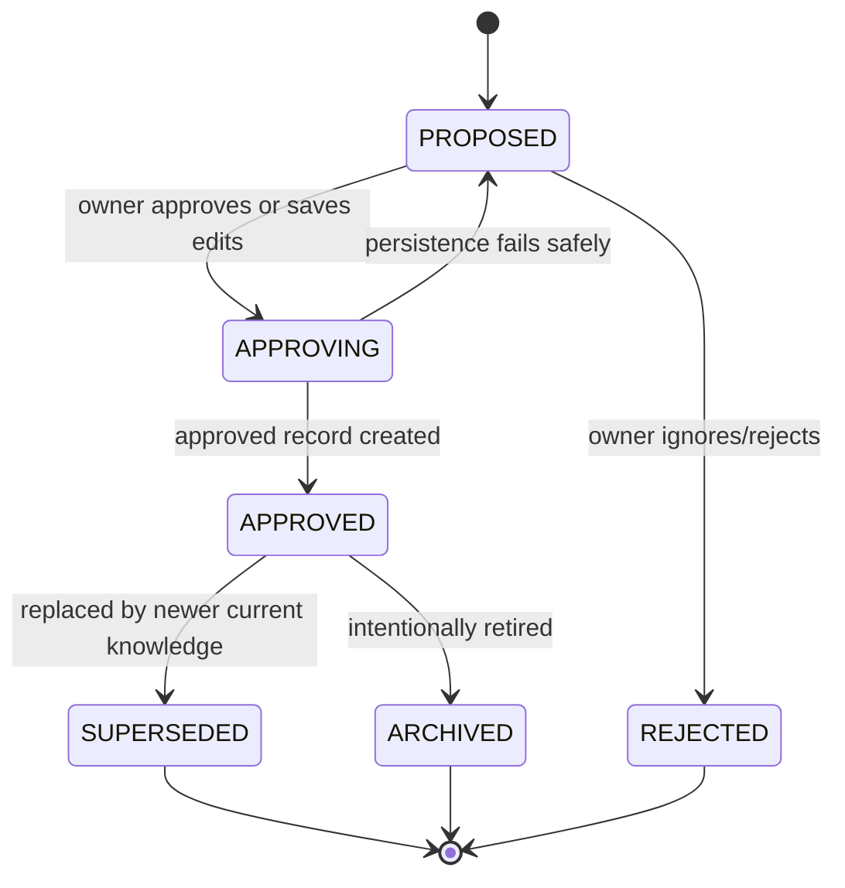
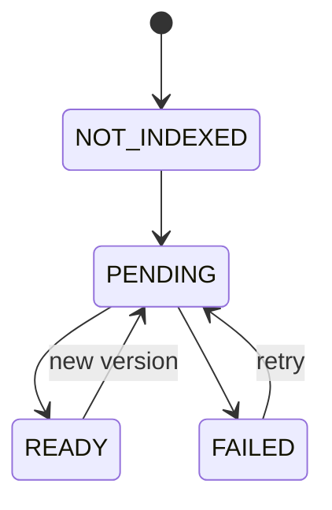

# Data Model

## 1. Modeling principles

- Company scope is mandatory on every business entity.
- Proposed and approved knowledge are separate concepts.
- Version history is immutable.
- The current memory record points to the active version.
- Search documents are derived from structured source-of-truth records.
- Sources and audit events retain provenance.
- Domain status and index status are separate.

## 2. Identifier types

Use opaque string IDs. Branded TypeScript types are encouraged.

```ts
type CompanyId = string & { readonly __brand: "CompanyId" };
type UserId = string & { readonly __brand: "UserId" };
type ConversationId = string & { readonly __brand: "ConversationId" };
type MessageId = string & { readonly __brand: "MessageId" };
type CandidateId = string & { readonly __brand: "CandidateId" };
type MemoryId = string & { readonly __brand: "MemoryId" };
type SourceId = string & { readonly __brand: "SourceId" };
type ArtifactId = string & { readonly __brand: "ArtifactId" };
```

## 3. Enumerations

### Memory type

```ts
type MemoryType =
  | "COMPANY_FACT"
  | "CUSTOMER_INSIGHT"
  | "BRAND_RULE"
  | "POLICY"
  | "DECISION"
  | "SOP"
  | "LESSON";
```

### Candidate status

```ts
type CandidateStatus =
  | "PROPOSED"
  | "APPROVING"
  | "APPROVED"
  | "REJECTED";
```

`APPROVING` supports an idempotent state transition. A failed approval operation must either return to `PROPOSED` or point to the created approved record; it must never remain ambiguous indefinitely.

### Memory status

```ts
type MemoryStatus =
  | "APPROVED"
  | "SUPERSEDED"
  | "ARCHIVED";
```

### Index status

```ts
type IndexStatus =
  | "NOT_INDEXED"
  | "PENDING"
  | "READY"
  | "FAILED";
```

### Conflict relation

```ts
type ConflictRelation =
  | "UNRELATED"
  | "DUPLICATE"
  | "UPDATE"
  | "CONTRADICTION"
  | "EXCEPTION";
```

### Role

```ts
type CompanyRole =
  | "OWNER"
  | "MANAGER"
  | "MARKETING"
  | "OPERATIONS"
  | "SALES"
  | "FRONT_DESK"
  | "EMPLOYEE";
```

### Sensitivity

```ts
type Sensitivity = "PUBLIC" | "INTERNAL" | "CONFIDENTIAL";
```

The MVP should not store secrets as memory at any sensitivity level.

## 4. Core entities

### 4.1 Company

```ts
interface Company {
  id: CompanyId;
  name: string;
  description: string;
  productsOrServices: string[];
  primaryCustomers: string[];
  differentiators: string[];
  brandVoice: string[];
  timezone: string;
  createdAt: string;
  updatedAt: string;
}
```

### 4.2 User membership

```ts
interface CompanyMembership {
  companyId: CompanyId;
  userId: UserId;
  displayName: string;
  roles: CompanyRole[];
  status: "ACTIVE" | "DISABLED";
  createdAt: string;
  updatedAt: string;
}
```

The demo may seed fixed memberships.

### 4.3 Conversation

```ts
interface Conversation {
  id: ConversationId;
  companyId: CompanyId;
  title: string;
  assistantRole: "MARKETING" | "OPERATIONS" | "EMPLOYEE";
  createdBy: UserId;
  createdAt: string;
  updatedAt: string;
}
```

### 4.4 Message

```ts
interface Message {
  id: MessageId;
  companyId: CompanyId;
  conversationId: ConversationId;
  actorType: "USER" | "ASSISTANT" | "SYSTEM_EVENT";
  actorId?: UserId;
  content: string;
  sourceRefs: SourceReference[];
  createdAt: string;
}
```

Do not persist hidden chain-of-thought or provider-private reasoning.

### 4.5 Source

```ts
interface Source {
  id: SourceId;
  companyId: CompanyId;
  kind: "CONVERSATION" | "WEBSITE" | "DOCUMENT" | "MANUAL";
  title: string;
  uri?: string;
  storageKey?: string;
  trustLevel: "OWNER_STATEMENT" | "INTERNAL_DOCUMENT" | "EXTERNAL_IMPORT";
  createdBy: UserId;
  createdAt: string;
}

interface SourceReference {
  sourceId: SourceId;
  label: string;
  messageId?: MessageId;
  excerpt?: string;
}
```

Excerpts must be short and safe to display.

### 4.6 Memory candidate

```ts
interface MemoryCandidate {
  id: CandidateId;
  companyId: CompanyId;
  conversationId?: ConversationId;
  type: MemoryType;
  title: string;
  statement: string;
  rationale: string | null;
  rationaleMissing: boolean;
  appliesToRoles: CompanyRole[];
  tags: string[];
  sensitivity: Sensitivity;
  sourceRefs: SourceReference[];
  confidence: number;
  relation: ConflictRelation;
  relatedMemoryIds: MemoryId[];
  status: CandidateStatus;
  extractionPromptVersion: string;
  modelId: string;
  createdBy: UserId;
  createdAt: string;
  reviewedBy?: UserId;
  reviewedAt?: string;
  approvedMemoryId?: MemoryId;
}
```

`confidence` is a model-assistance signal, not a truth score. It must not trigger automatic approval.

### 4.7 Memory record

```ts
interface MemoryRecord {
  id: MemoryId;
  companyId: CompanyId;
  type: MemoryType;
  status: MemoryStatus;
  currentVersion: number;
  title: string;
  appliesToRoles: CompanyRole[];
  sensitivity: Sensitivity;
  tags: string[];
  effectiveFrom: string;
  supersedesMemoryId?: MemoryId;
  supersededByMemoryId?: MemoryId;
  createdAt: string;
  updatedAt: string;
  indexStatus: IndexStatus;
  indexDocumentId?: string;
  lastIndexAttemptAt?: string;
  indexErrorCode?: string;
}
```

The record contains list-view and retrieval-routing fields. Canonical content lives in versions.

### 4.8 Memory version

```ts
interface MemoryVersion {
  memoryId: MemoryId;
  companyId: CompanyId;
  version: number;
  title: string;
  statement: string;
  rationale: string | null;
  appliesToRoles: CompanyRole[];
  sensitivity: Sensitivity;
  tags: string[];
  effectiveFrom: string;
  sourceRefs: SourceReference[];
  approvedBy: UserId;
  approvedAt: string;
  originatingCandidateId?: CandidateId;
  createdAt: string;
}
```

Versions are append-only. Corrections create a new version.

### 4.9 Artifact

```ts
interface Artifact {
  id: ArtifactId;
  companyId: CompanyId;
  kind: "MARKETING_CAMPAIGN" | "SOP_DRAFT";
  title: string;
  status: "DRAFT" | "SUGGESTED" | "APPROVED" | "ARCHIVED";
  content: unknown;
  sourceMemoryRefs: Array<{ memoryId: MemoryId; version: number }>;
  createdBy: UserId | "ASSISTANT";
  createdAt: string;
  updatedAt: string;
}
```

### 4.10 Audit event

```ts
interface AuditEvent {
  id: string;
  companyId: CompanyId;
  actorId: UserId | "SYSTEM";
  action:
    | "CANDIDATE_CREATED"
    | "CANDIDATE_EDITED"
    | "CANDIDATE_APPROVAL_STARTED"
    | "CANDIDATE_APPROVED"
    | "CANDIDATE_REJECTED"
    | "MEMORY_VERSION_CREATED"
    | "MEMORY_SUPERSEDED"
    | "MEMORY_ARCHIVED"
    | "INDEX_REQUESTED"
    | "INDEX_READY"
    | "INDEX_FAILED"
    | "DEMO_RESET";
  targetType: string;
  targetId: string;
  metadata: Record<string, string | number | boolean | null>;
  createdAt: string;
}
```

## 5. Memory lifecycle



Index lifecycle is separate:



## 6. Retrieval eligibility

A memory is authoritative only when all are true:

```ts
memory.companyId === request.companyId
memory.status === "APPROVED"
memory.indexStatus === "READY" // except explicit controlled fallback
requestedRole is allowed by memory.appliesToRoles
actor is allowed to view memory.sensitivity
requested version === memory.currentVersion
```

Centralize this logic in one tested domain function.

## 7. DynamoDB single-table design

### Primary keys

| Entity | PK | SK |
|---|---|---|
| Company | `COMPANY#{companyId}` | `PROFILE` |
| Membership | `COMPANY#{companyId}` | `MEMBER#{userId}` |
| Conversation | `COMPANY#{companyId}` | `CONVERSATION#{conversationId}` |
| Message | `CONVERSATION#{conversationId}` | `MESSAGE#{createdAt}#{messageId}` |
| Candidate | `COMPANY#{companyId}` | `CANDIDATE#{candidateId}` |
| Memory record | `COMPANY#{companyId}` | `MEMORY#{memoryId}` |
| Memory version | `MEMORY#{memoryId}` | `VERSION#{versionPadded}` |
| Source | `COMPANY#{companyId}` | `SOURCE#{sourceId}` |
| Artifact | `COMPANY#{companyId}` | `ARTIFACT#{artifactId}` |
| Audit event | `COMPANY#{companyId}` | `AUDIT#{createdAt}#{eventId}` |

### GSI1

Use GSI1 for status/type views.

Examples:

| Query | GSI1PK | GSI1SK |
|---|---|---|
| Proposed candidates | `COMPANY#{companyId}#CANDIDATE#PROPOSED` | `{createdAt}#{candidateId}` |
| Memories by type | `COMPANY#{companyId}#MEMORY#{type}` | `{updatedAt}#{memoryId}` |
| Current approved memories | `COMPANY#{companyId}#MEMORY#APPROVED` | `{updatedAt}#{memoryId}` |
| Conversations by role | `COMPANY#{companyId}#CONVERSATION#{role}` | `{updatedAt}#{conversationId}` |

Do not rely on a scan for primary UI flows.

## 8. Required access patterns

1. Load company profile.
2. List company memberships.
3. Create and list conversations by role.
4. Append and list messages in one conversation.
5. Create candidate.
6. List proposed candidates for a company.
7. Conditionally transition candidate state.
8. Create memory and version atomically where possible.
9. Load current memory and version by ID.
10. List current memories by type.
11. Load versions for a memory.
12. Update index status conditionally.
13. List recent audit events.
14. Delete/reset demo-company entities safely.

## 9. Canonical index document

Render a memory version into deterministic Markdown:

```markdown
# Promotional discounts must not exceed 15%

- Company ID: demo-salon
- Memory ID: mem_...
- Version: 1
- Type: DECISION
- Status: APPROVED
- Effective from: 2026-07-11T...
- Applies to: MARKETING, SALES, FRONT_DESK
- Sensitivity: INTERNAL

## Company rule

Promotional discounts must not exceed 15%. Prefer complimentary add-ons over deeper discounts.

## Rationale

Protect margins and maintain premium brand positioning.

## Sources

- Tuesday campaign conversation, message ...

## Approval

Approved by ... at ...
```

The render function must be deterministic so retries produce the same content for the same version.

## 10. Validation and size limits

Initial safe limits:

- Title: 120 characters.
- Statement: 2,000 characters.
- Rationale: 2,000 characters.
- Tag: 40 characters; maximum 10 tags.
- Applies-to roles: maximum 10.
- Source references: maximum 10.
- Display excerpt: maximum 300 characters.
- Chat message: set a reasonable server-side limit and surface it clearly.

Codex may adjust exact limits but must keep them explicit and tested.
