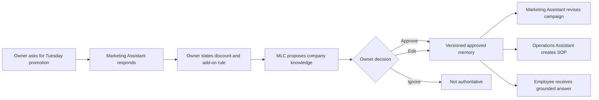

# Product Specification

## 1. Summary

My Little Company turns owner conversations into approved, reusable company knowledge for AI assistants and employees.

### One-line description

Turn the knowledge in a business owner’s head into trusted memory for every employee and AI assistant.

### Value proposition

- Owners explain less often.
- Employees receive consistent answers.
- AI work follows current company rules.
- Decisions retain their rationale and source.
- Knowledge survives tool changes and staff turnover.

## 2. Goals

### MVP goals

- Demonstrate one end-to-end organizational-memory loop.
- Make approval clear and easy for a non-technical owner.
- Reuse one approved decision across Marketing, Operations, and Employee modes.
- Preserve rationale, source, scope, approval, and version.
- Keep the demo deterministic and independent of external model or vector-service availability.
- Provide a polished, resettable judge demo.

### Success criteria

The MVP is successful when a judge can observe all of the following without explanation from the developer:

1. MLC understands the company context.
2. It recognizes a durable decision in normal conversation.
3. It does not silently save that decision.
4. The owner can approve it easily.
5. Future AI work follows the approved decision.
6. An employee answer cites the decision and its rationale.
7. Unapproved information is not treated as company truth.

## 3. Functional requirements

### FR-01 Company setup

The user can load or create a company profile containing:

- Company name.
- Description.
- Services or products.
- Primary customers.
- Differentiators.
- Brand voice.
- Important existing rules.

**MVP implementation:** load the salon demo fixture and allow editing basic fields.

**Acceptance criteria:**

- The profile is associated with one `companyId`.
- Empty required fields are explained in plain language.
- Saved profile context is available to the Marketing Assistant.

### FR-02 Conversational workspace

The owner can send messages to the Marketing Assistant and receive a response using approved company context.

**Acceptance criteria:**

- Messages persist within the conversation.
- The owner can list and reopen previous conversations.
- Each conversation has an explicit company or department knowledge scope.
- The response clearly separates approved company context from new recommendations.
- Relevant sources appear as source chips when available.
- A collapsible context panel shows sources used in the conversation, recent
  approved knowledge eligible for its scope, and suggestions awaiting review.
- Failure states do not lose the owner’s draft message.

### FR-03 Suggested company knowledge

After a conversation turn, MLC can produce zero or more structured suggestions.

Each suggestion includes:

- Type.
- Title.
- Canonical statement.
- Rationale or an explicit missing-rationale marker.
- Roles or teams affected.
- Source reference.
- Confidence.
- Possible relationship to existing approved memory.

**Acceptance criteria:**

- Casual or temporary statements may produce no suggestion.
- Suggestions are visibly labeled as awaiting review.
- Model output is validated before display or persistence.
- Invalid output fails safely and can be retried.

### FR-04 Review and approval

The owner can approve, edit, or ignore a suggestion.

**Acceptance criteria:**

- Approval requires an authenticated or demo-authorized owner action on the server.
- Approval records the actor and timestamp.
- Editing creates the approved canonical content actually chosen by the owner.
- Ignored suggestions cannot become searchable company truth.
- The UI confirms whether indexing succeeded, is pending, or failed.

### FR-05 Company Playbook

The user can browse approved company knowledge by type and open a detail page.

**Acceptance criteria:**

- Only approved or explicitly archived entries appear according to the chosen filter.
- Each detail shows current statement, rationale, source, applicable roles, approver, approval date, and version.
- An owner can directly amend the title, canonical statement, rationale, and role scope from the detail page.
- A direct owner amendment creates a new approved immutable version, preserves prior versions, records the edit as a source, and refreshes the derived knowledge index.
- The detail page distinguishes Playbook truth from assistant-search availability and exposes a retry when indexing fails.
- Superseded versions remain available in history but are not shown as current truth.
- The owner can browse pages by company and department and create an approved page directly.
- The owner can filter the same approved records through Company basics,
  Customers, Brand, Decisions and policies, and How we work. These are
  presentation groups rather than additional memory types.
- A page created with `/save-knowledge` references verified messages from the current conversation.

### FR-06 Approved-memory retrieval

The system retrieves relevant approved knowledge for a role and company.

**Acceptance criteria:**

- Retrieval is always scoped by `companyId`.
- Retrieval excludes proposed, rejected, archived, and superseded records by default.
- Retrieval respects role scope.
- Company-scoped knowledge is eligible in every department; department-scoped
  knowledge is eligible only for that department.
- A narrower department rule cannot silently override a company rule; it must be
  represented and approved as an explicit exception.
- Returned context includes memory ID, version, title, statement, rationale, and source IDs.
- If no adequate context exists, the assistant says it lacks an approved company rule.

### FR-07 Marketing Assistant

The assistant creates campaign ideas grounded in approved company knowledge.

**Acceptance criteria:**

- The revised Tuesday offer follows the 15% maximum discount rule.
- It prefers a complimentary add-on when appropriate.
- It explains which approved rules influenced the recommendation.
- It does not label its recommendation as an approved policy.

### FR-08 Operations Assistant

The assistant creates an SOP from an approved campaign or decision.

**Acceptance criteria:**

- The SOP has title, purpose, owner, prerequisites, steps, checks, exceptions, and source references.
- The SOP reflects the approved pricing and brand decision.
- The SOP follows the owner's actual request rather than substituting a canned
  demo procedure.
- Saving the generated SOP creates a new suggestion requiring approval; it does not become approved automatically.

### FR-09 Employee Q&A

An employee can ask a company-policy question and receive a grounded answer.

**Acceptance criteria:**

- “Can I give a customer 25% off?” receives a clear “No” based on the approved policy.
- The answer includes the 15% maximum and preference for free add-ons.
- The source and approval date are visible.
- If the policy is absent or not approved, the answer must not invent it.

### FR-10 Conflict detection

The system compares a suggestion with potentially related approved memories.

**Relations:**

- `UNRELATED`
- `DUPLICATE`
- `UPDATE`
- `CONTRADICTION`
- `EXCEPTION`

**Acceptance criteria:**

- A possible contradiction cannot be silently approved over an existing record.
- The owner can replace the current memory, keep an explicit exception, edit, or ignore.
- Superseding creates a new version or record link and preserves history.

### FR-11 Audit trail

Material memory actions are recorded.

**Acceptance criteria:**

- Record suggestion creation, edit, approval, rejection, supersession, archive, indexing attempt, and indexing result.
- Audit entries include company, actor, timestamp, action, target, and safe metadata.
- Do not store secrets or full hidden prompts in the audit trail.

### FR-12 Demo reset

The presenter can restore the demo to its initial state.

**Acceptance criteria:**

- Reset requires a deliberate action.
- It affects only the demo company.
- It restores deterministic fixture data and removes demo-generated records.
- It reports success or failure accurately.

### FR-13 Login and scoped company access

The owner can invite people and grant independent read, suggest, and approve
access for the whole company or a department.

**Acceptance criteria:**

- `/login` hands deployed identity to Cognito managed login; `/login-demo` uses
  clearly marked seeded accounts through the same server actor boundary.
- Every request reloads an active membership; browser roles and scopes are ignored.
- Owners can do anything and manage access without changing the primary navigation.
- Department reads include relevant company knowledge but exclude sibling teams.
- Delegated approvers decide suggestions in scope but cannot directly amend the Playbook.
- Disabled membership and grant changes take effect on the next request.
- Non-owners see only their own conversation history.
- Compatible MCP clients can link one My Little Company account, search/fetch only
  eligible approved knowledge, and create source-backed suggestions when both
  OAuth consent and the current membership allow it.
- Connected assistants expose no approval operation. A suggestion remains outside
  retrieval until a scoped human reviewer resolves any conflict, approves it,
  and indexing succeeds.

### FR-14 Waitlist-only public access

Public visitors can request future access without creating an account. Account
creation remains invite-only through an existing owner.

**Acceptance criteria:**

- Public navigation, landing actions, and login show `Join the waitlist`, not
  `Create account` or a direct anonymous product-entry action.
- Joining requires a valid email and may include a name and company.
- Duplicate email submissions are idempotent and receive the same success message.
- The public response never reveals whether an email was already registered.
- Waitlist entries persist locally and in DynamoDB without entering company data.
- Cognito self-registration remains disabled; owners invite people through
  People & access.
- Joining the waitlist creates no identity, session, membership, or company access.

## 4. Non-functional requirements

### Simplicity

- The primary path should require no AI configuration.
- A first-time user should understand the approval card without documentation.
- Technical terms are hidden or translated into plain language.

### Trust

- Every authoritative claim is traceable to approved memory.
- The UI visibly distinguishes suggestions, approved knowledge, and generated artifacts.
- Errors never masquerade as successful approval or indexing.

### Security

- Server-side company and role scope.
- Secrets stay server-side.
- Imported and retrieved content is untrusted.
- No automatic promotion from source to approved memory.

### Reliability

- The complete demo works without cloud credentials or model capacity.
- Network operations use bounded retries and timeouts.
- State transitions are idempotent where practical.

### Accessibility

- Keyboard-accessible primary flows.
- Clear focus states.
- Semantic labels for buttons and forms.
- Status is not conveyed by color alone.

### Performance

- Show immediate local feedback when a message or approval is submitted.
- Long AI and indexing work exposes progress and retry status.
- Avoid loading the entire playbook for a single retrieval query.

## 5. User stories

### Owner

- As an owner, I want to explain a business rule naturally so I do not have to write formal documentation.
- As an owner, I want to approve what the system remembers so it cannot silently change company truth.
- As an owner, I want the reason behind a decision preserved so employees can use judgment later.
- As an owner, I want generated marketing to follow my brand and pricing rules.
- As an owner, I want a campaign turned into a repeatable SOP.

### Employee

- As an employee, I want to ask a question in plain language and receive the current approved answer.
- As an employee, I want to see where the answer came from so I can trust it.
- As an employee, I want ambiguity surfaced instead of receiving a confident invention.

### Connected assistant user

- As an external assistant user, I want the assistant to retrieve current company
  context without copying it between products.
- As a contributor, I want a durable rule noticed in an external conversation to
  arrive in Review with a small evidence excerpt, not synchronize my whole chat.
- As a reviewer, I want approval to remain in My Little Company so an external
  assistant cannot silently change company truth.

### Presenter

- As a presenter, I want a deterministic resettable demo so the full story works reliably.

## 6. Primary journey

## 7. Out-of-scope requirements

Do not treat these as MVP requirements:

- Autonomous social publishing.
- Full user provisioning and SSO.
- Marketplace discovery of humans or agents.
- Complex workflow orchestration.
- Company-wide analytics dashboards.
- Billing and subscription management.
- Voice-first experience.
- Real-time collaborative editing.
- Native mobile application.

## 8. Proof-first company onboarding

The Slice 1 activation target is one source-backed proof in under four minutes:

1. A signed-in owner writes one real company question.
2. The owner pastes relevant text or selects one conversation from a ChatGPT `conversations.json` export.
3. My Little Company proposes at most twelve durable knowledge items and prioritizes three for setup.
4. The owner approves, edits, or ignores each proposal. Imported content never becomes company truth automatically.
5. After the first relevant approval, My Little Company answers the original question and cites knowledge approved from that import.

ChatGPT exports are parsed in the browser. Only the selected conversation is uploaded. Quick setup accepts at most 40,000 selected characters. Approved company basics become normal `COMPANY_FACT` suggestions; onboarding never silently rewrites the Company profile or creates a second folder taxonomy.

Company creation, invited-user welcome, WhatsApp text export, Google Drive, website, and Notion connectors remain later slices and require separate implementation checkpoints.
